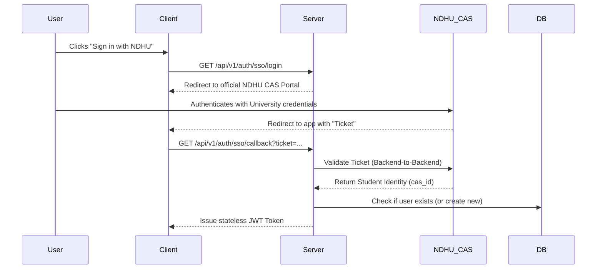
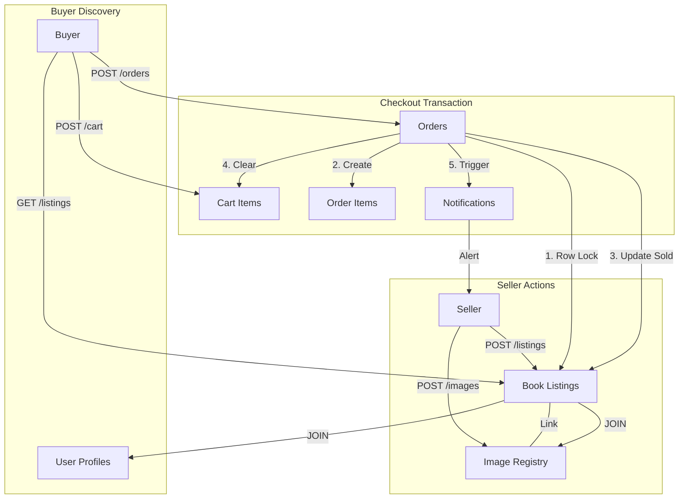

# NDHU Second-Hand Book Store (SHBS) - Server Technical Overview

This document provides a deep dive into the server-side architecture, authentication flow, and database design of the SHBS marketplace.

---

## 1. Authentication & Identity
The SHBS server implements a **Hybrid Authentication System** to maximize both security and convenience for NDHU students.

### **Authentication Flow (SSO/CAS)**


### **The "Gist" of Auth Implementation**
- **Hybrid Support:** The `users` table has a nullable `password_hash` (for local accounts) and a nullable `cas_id` (for SSO). This allows a single user to potentially link both methods.
- **Middleware-First:** Every protected route uses an `Auth` middleware that parses the JWT from the `Authorization` header, validates it against the `token_blacklist`, and injects the `userID` into the request context (`c.Locals`).
- **Security:** Passwords (local) are hashed using **bcrypt**. JWTs are signed with a 32-character minimum secret.

---

## 2. Feature Implementation Details

### **A. Listings & Images (Discovery & Content)**
- **N+1 Avoidance:** Instead of fetching a book and then making 10 more queries for its images, we use `COALESCE(array_agg(img.cdn_url), '{}')`. This aggregates all image URLs into a single PostgreSQL array column in the main query.
- **Image Registry:** We use a "Registry Pattern." Images are registered in the `images` table first (returning a UUID). This UUID is then used to create or update a listing. This decouples file storage from business logic.

### **B. Cart (The Staging Area)**
- **Idempotency:** The `HandleAddToCart` uses `ON CONFLICT (buyer_id, listing_id) DO NOTHING`. This means if a user clicks "Add to Cart" multiple times, the server stays "silent" and doesn't create duplicate entries.
- **Validation:** The server checks if a book is `active` before allowing it into the cart.

### **C. Orders & Checkout (The Transaction)**
- **Strict Locking:** During checkout, we use `SELECT ... FOR UPDATE OF l`. This is the "gist" of our concurrency safety. It tells Postgres: "I am about to change these specific book rows; don't let anyone else even touch them until I am done."
- **Immutable History:** We store `price_at_purchase` in `order_items`. Even if the listing is later deleted or the price is changed by the seller, the buyer's receipt remains accurate.

### **D. Messaging (Private Threads)**
- **Listing-Scoped:** Every conversation is uniquely identified by `(listing_id, user_A, user_B)`.
- **Read Tracking:** When `GET /messages` is called, the server executes a background `UPDATE` to set `is_read = true` for all messages where the caller is the receiver.

### **E. Notifications (Event Hooks)**
- **Polymorphism via JSONB:** The `notifications` table doesn't have columns like `order_id` or `message_id`. Instead, it has a `payload` column.
- **Gist:** This allows us to add new notification types (e.g., "Price Drop", "Admin Warning") without ever running a database migration.

---

## 3. Database Schema Design (The "Why")
The schema is designed for **strict data integrity** and **efficient querying**.

### **Marketplace Data Flow**


---

## 4. Docker Integration
The project is containerized for seamless deployment.

### **Dockerfile Strategy**
- **Multi-Stage Build:** 
    - *Stage 1 (Builder):* Uses `golang:alpine` to compile the binary. It uses `-ldflags="-s -w"` to strip debug info, resulting in a tiny 15MB binary.
    - *Stage 2 (Production):* Uses a bare `alpine` image. It copies only the binary and migrations. No source code or compilers are included in the final image, significantly reducing the attack surface.
- **Security:** The process runs as `appuser` (non-root). Even if a vulnerability is found in the code, the attacker does not have root access to the container.

### **Docker Compose**
A `docker-compose.yml` is provided to spin up the entire environment (App + Postgres) with a single command:
```bash
docker-compose up --build
```

---

## 5. Security Summary

| Risk | Mitigation |
| :--- | :--- |
| **SQL Injection** | **Parameterized Queries:** We never build SQL strings with user input. |
| **IDOR (Ownership)** | **Explicit Checks:** Every `Update` or `Delete` query includes `WHERE id = $id AND user_id = $myID`. |
| **Double Spend** | **FOR UPDATE Locks:** Prevents two users from buying the same item. |
| **Container Breakout** | **Non-Root User:** The app runs with minimal privileges in Docker. |
